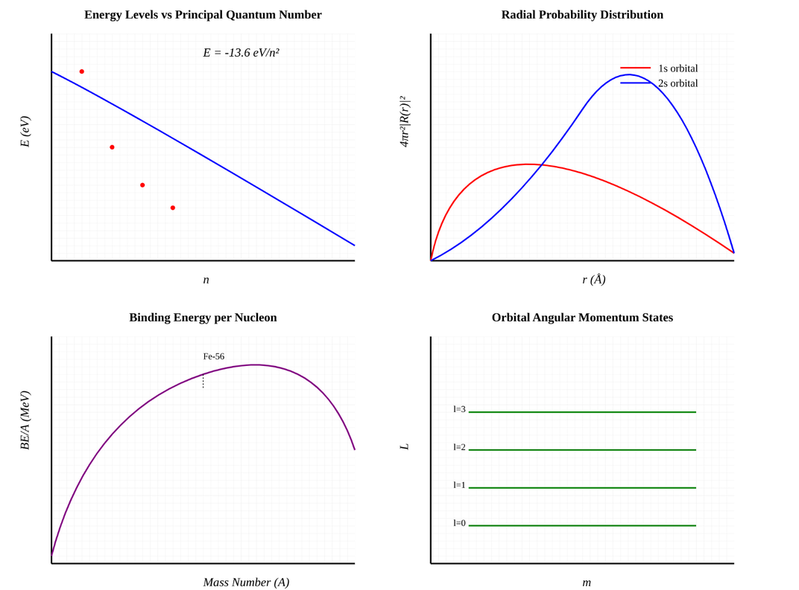

# Assignment 2 

### ATOMIC LEVEL FORMULAE & THEIR GRAPHICAL RELATIONS
OBTAIN ALL THE POSSIBLE MATHEMATICAL RELATIONS BASED ON AN ATOM & GENERATE THEIR GRAPHICAL RELATIONS? 


# Atomic Mathematical Relations

## 1. Bohr's Atomic Model

### Energy Relations
- Total energy of electron in nth shell:  
  ```
  En = -13.6 eV × (1/n²)
  ```

- Energy difference between levels n1 and n2:  
  ```
  ΔE = 13.6 eV × (1/n1² - 1/n2²)
  ```

### Orbital Properties
- Radius of nth shell:  
  ```
  rn = 0.529 Å × n²
  ```

- Orbital velocity in nth shell:  
  ```
  vn = 2.19 × 10⁶ m/s × (1/n)
  ```

- Angular momentum:  
  ```
  L = n × ℏ
  ```
  where ℏ is the reduced Planck's constant (1.054 × 10⁻³⁴ J·s)

## 2. Quantum Numbers

### Electron Configuration Rules
- Maximum electrons in shell n:  
  ```
  N = 2n²
  ```

- Maximum electrons in subshell:  
  ```
  N = 2(2l + 1)
  ```

- Number of orbitals in subshell:  
  ```
  N = 2l + 1
  ```

### Quantum Number Constraints
- Principal quantum number (n):
  ```
  n = 1, 2, 3, ...
  ```

- Angular momentum quantum number (l):
  ```
  0 ≤ l ≤ (n-1)
  ```

- Magnetic quantum number (ml):
  ```
  -l ≤ ml ≤ +l
  ```

- Spin quantum number (ms):
  ```
  ms = +½ or -½
  ```

## 3. Nuclear Physics

### Mass-Energy Relations
- Mass defect:
  ```
  Δm = (Z × mp + N × mn) - matom
  ```

- Nuclear binding energy:
  ```
  E = Δm × c²
  ```

- Binding energy per nucleon:
  ```
  BE/A = (Δm × c²)/A
  ```
  where A is the mass number (A = N + Z)

### Nuclear Stability
- For light stable nuclei:
  ```
  N/Z ≈ 1
  ```

- For heavy stable nuclei:
  ```
  N/Z ≈ 1.5
  ```

## 4. Electronic Properties

### Atomic Properties
- First ionization energy:
  ```
  Ei = 13.6 eV × Z² × (1/n²)
  ```

- Electron affinity:
  ```
  EA = -13.6 eV × Z² × (1/n²)
  ```

- Pauling electronegativity:
  ```
  χ = √(Ei + EA)/2
  ```

### Spectroscopic Relations
- Wavelength:
  ```
  λ = hc/ΔE
  ```

- Frequency:
  ```
  ν = ΔE/h
  ```

- Wavenumber:
  ```
  ṽ = 1/λ = ΔE/hc
  ```

## 5. Uncertainty Relations

### Heisenberg's Uncertainty Principle
- Position-momentum uncertainty:
  ```
  Δx × Δp ≥ ℏ/2
  ```

- Energy-time uncertainty:
  ```
  ΔE × Δt ≥ ℏ/2
  ```

## 6. Wave Properties

### de Broglie Relations
- Wavelength:
  ```
  λ = h/p = h/(mv)
  ```

- Wave frequency:
  ```
  E = hν = hc/λ
  ```

### Schrödinger Equation (Time-Independent)
- One-dimensional form:
  ```
  -ℏ²/2m × d²ψ/dx² + V(x)ψ = Eψ
  ```


## Graphical relations 
Displayed below are the graphical relations of various atomic phenomenon 

